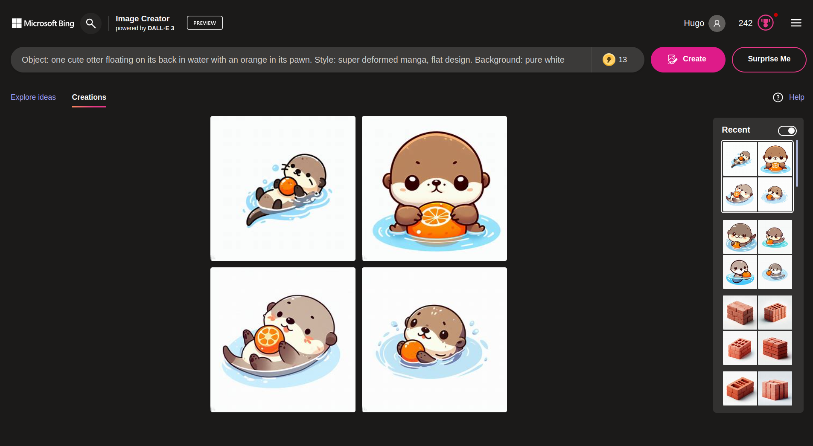
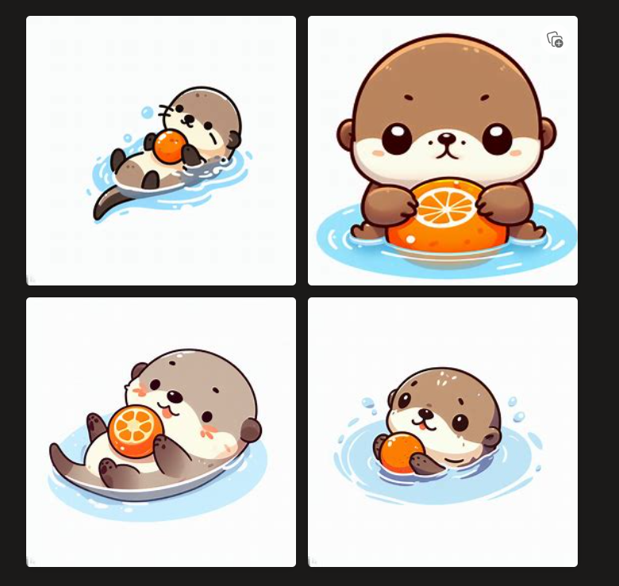

**WikiVoc.js** is a toolbox to assist the creation of illustrated language learning flashcard. Centered on English language as its corner stone, we built dedicated modules to handle the word-prompt dictionary, generate images, vectorize images, and pivot to non-English languages.

## Modules
- `words.js`: dictionary of English word and illustration description pairs, such as
  - `{ "otter": "a cute smiling otter flowting on the watter with an orange ball in her tiny pawn" }`
- `generate.js`: images generation
- `vectorize.js`: images vectorisation
- `pivot/fr.js`: alternative languages pointing to the English word-illustration, such as
  - `{ word: "loutre", illustration: "otter" }`.

## Flashcards demo
Each of these flashcards have been generated from prompts, then hand selected from 4~12 candidates images.
| | | | |
|----|----|----|----|
| <br><center>arm</center> | <br><center>bag</center> | <br><center>ball</center> | <br><center>basket</center> 
| <br><center>bath</center> | <br><center>berry</center>  | <br><center>bed</center> | <br><center>bird</center>
| <br><center>bone</center> | <br><center>box</center> | <br><center>boots</center> | <br><center>bottle</center> 
| <br><center>boy</center> | <br><center>bucket</center> | <br><center>handbag</center> | <br><center>basket</center> 
| <br><center>ribbon</center> | <br><center>schoolgirls</center> | <br><center>squeleton</center> | <br><center>tree</center> | <br><center>toilet</center>

Our prompt template reads :
```
Object: one cute otter floating in water with an orange in its pawn. Style: super deformed manga, flat design. Background: pure white background. View: wide shot. 
```

## Web user interface
You can generate images by hand, with no developement skills.
1. Open [Bing.com/images/create/](https://www.bing.com/images/create/object3a-one-cute-otter-floating-on-its-back-in-wat/653783e9b3f64c95aaf6ea027643746f?FORM=GENCRE) > create an account.
2. Enter prompt :<br>`Object: one cute otter floating on its back in water with an orange in its pawn. Style: super deformed manga, flat design. Background: pure white background. View: wide shot. ` > click "Create"
3. Click on prefered image, save locally as `WikiVoc—otter.jpg`
4. Change prompt's object statement as needed.

| Bing Image Generator with standardized prompt | Bing Image Results (4) | Selected "otter" illustration |
|----|----|----|
| <br><center></center> | <br><center></center> | <br><center></center>


## APIs
The core work is mostly on dictionary and prompt creation. We then rely on **paid APIs** to scale up work and state of the art image generations and vectorization. At the moment, we use :
- [Dall-e 3/api](https://platform.openai.com/docs/api-reference/images)
- [Vectorizer.ai/api](https://vectorizer.ai/api)

Alternative solutions exist which are open, cheaper, but also lower quality solutions. At the moment, we therefore decided to go for those paid APIs.

## Todo
- [x] Readme.md
- [x] Create a github repository
- [x] Create a proper git ignore
- [ ] Externalize API keys
- [ ] Migrate words out of `generate.js`
